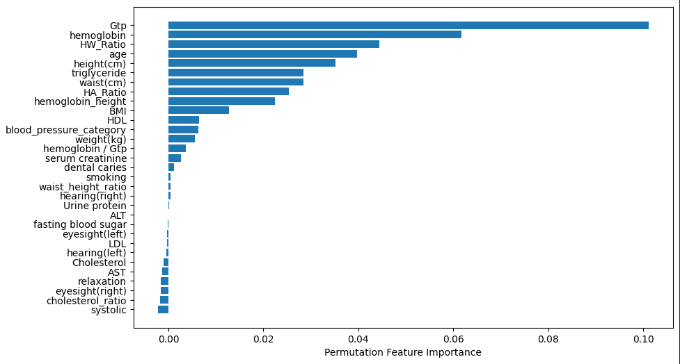
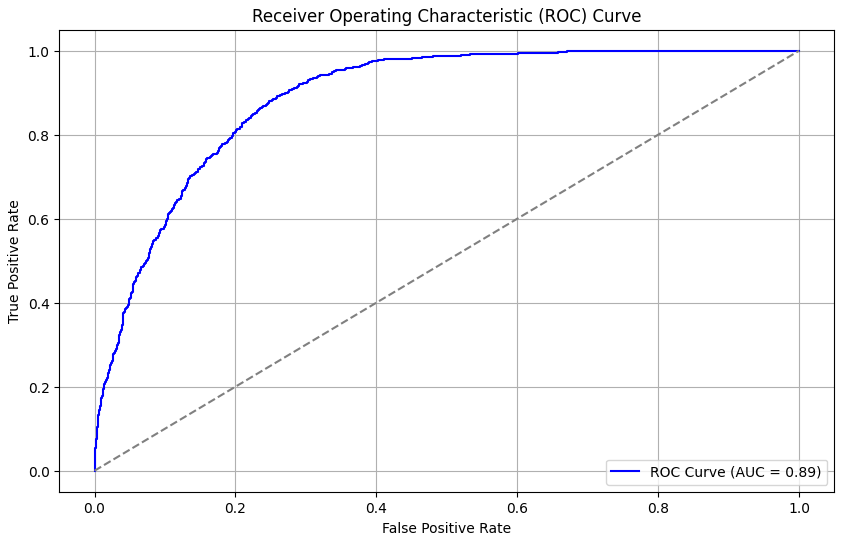

# Smoker Status Prediction Using Bio-Signals

## Project Overview

This project aims to predict individuals' smoking status using various bio-signal features, leveraging machine learning models to classify participants as smokers or non-smokers. The dataset encompasses biometric, biochemical, and clinical features commonly associated with lifestyle habits and health status. By building an effective predictive model, this project offers insights into health patterns correlated with smoking status, potentially aiding healthcare providers in identifying individuals at risk.

## Table of Contents

- [Project Overview](#project-overview)
- [Dataset Description](#dataset-description)
- [Feature Engineering](#feature-engineering)
- [Modeling Approach](#modeling-approach)
- [Performance Evaluation](#performance-evaluation)
- [Installation](#installation)
- [Usage](#usage)
- [Results](#results)
- [Contributing](#contributing)
- [License](#license)

## Dataset Description

The dataset includes 15,000 rows and 28 features covering demographics, physical measurements, blood biochemistry, and other health indicators. The target variable is **smoking status** (`smoking` column), a binary classification between smokers and non-smokers. Key features include:

- **Age, Height, Weight, Waist Circumference**: Basic biometric data
- **Eyesight (Left/Right), Hearing (Left/Right)**: Sensory abilities
- **Blood Pressure (Systolic, Diastolic)**: Cardiovascular indicators
- **Cholesterol, HDL, LDL, Triglycerides**: Blood lipid profile
- **Hemoglobin, Serum Creatinine, AST, ALT, GTP**: Biochemical markers of liver and kidney function
- **Dental Caries**: Presence of dental health issues
  
**Additional Features Created**:
- **BMI**: Body mass index to assess weight status.
- **HW Ratio**: Height-to-Weight ratio, indicating body composition.
- **Hemoglobin/GTP**: Potential indicator of liver function issues.
- **Cholesterol Ratio**: Comparison between HDL and total cholesterol.
- **Blood Pressure Category**: Categorical variable for hypertension status.
- **Waist-to-Height Ratio**: Indicator of abdominal obesity.
- **Liver Enzyme Ratio**: Ratio of AST to ALT, another liver health marker.

These features contribute to a comprehensive dataset for predicting smoking habits.

## Feature Engineering

Feature engineering is crucial in this project, as it enhances model performance and interpretability. Key transformations and engineered features include:

1. **BMI Calculation**: Derived from height and weight to assess general health.
2. **Waist-Height Ratio**: Indicator of visceral fat, a risk factor often associated with smoking.
3. **Blood Pressure Categories**: Simplifying continuous blood pressure readings into categories for better model interpretability.
4. **Cholesterol Ratio and Liver Enzyme Ratio**: Ratios capturing lipid and liver health, both potentially impacted by smoking.

### Feature Importance


*This chart highlights the most influential features identified by the model, which contribute significantly to predicting smoking status.*

## Modeling Approach

The project employs a **stacking ensemble model** combining the strengths of several classifiers, specifically:

- **Logistic Regression**: As a baseline classifier for its simplicity and interpretability.
- **Random Forest Classifier**: Leveraged for its robustness and handling of feature interactions.
  
A stacking approach allows blending individual model predictions to create a final, meta-model that captures a broader range of patterns within the data.

### Tools and Libraries

- **Pandas, Numpy**: For data manipulation and processing.
- **Scikit-Learn**: For model building, evaluation, and stacking.
- **Matplotlib, Seaborn**: For data visualization.

## Performance Evaluation

Model performance is assessed using **ROC-AUC** to measure classification effectiveness in distinguishing smokers from non-smokers. The goal is to reach or exceed a **ROC-AUC score of 0.99**, indicating high model accuracy.

### ROC-AUC Curve


*This ROC-AUC curve represents the classifier’s ability to distinguish between smokers and non-smokers, showing the trade-off between true positive and false positive rates.*

## Installation

Clone this repository and install the necessary dependencies:

```bash
git clone <repository-link>
cd smoker-status-prediction
pip install -r requirements.txt
```

## Usage

1. **Data Preparation**: Ensure the dataset is in the required format with necessary preprocessing steps.
2. **Model Training**: Run the `train_model.py` script to train the stacking classifier.
3. **Prediction**: Use the `predict.py` script to generate predictions on test data.

```bash
python train_model.py
python predict.py --input test_data.csv --output predictions.csv
```

## Results

After training, the model achieved:

- **Validation ROC-AUC**: 0.0.8888831939010476
- **Test ROC-AUC**: Targeting 0.89 for robust classification performance.

## Contributing

Contributions are welcome! Please fork the repository, create a feature branch, and submit a pull request.

## License

This project is licensed under the MIT License.
